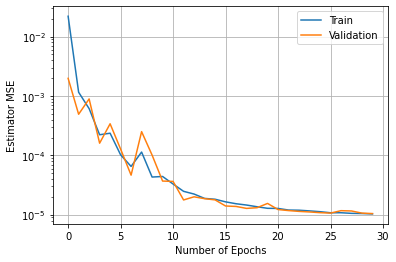

# Enhancing PHY-Security of FD-Enabled NOMA Systems Using Jamming and User Selection: Performance Analysis and DNN Evaluation

**Kyusung Shim, Tri Nhu Do, Toan-Van Nguyen, Daniel Benevides da Costa, and Beongku An**   

## Abstract

In this paper, we study the physical layer security (PHY-security) improvement method for a downlink non-orthogonal multiple access (NOMA) system in the presence of an active eavesdropper. To this end, we propose a full-duplex (FD)-enabled NOMA system and a promising scheme, called minimal transmitter selection (MTS) scheme, to support secure transmission. Specifically, the cell-center and cell-edge users act simultaneously as both receivers and jammers to degrade the eavesdropper channel condition. Additionally, the proposed MTS scheme opportunistically selects the transmitter to minimize the maximum eavesdropper channel capacity. To estimate the secrecy performance of the proposed methods, we derive an approximated closed-form expression for secrecy outage probability (SOP) and build a deep neural network (DNN) model for SOP evaluation. Numerical results reveal that the proposed NOMA system and MTS scheme improve not only the SOP but also the secrecy sum throughput. Furthermore, the estimated SOP through the DNN model is shown to be tightly close to other approaches, i.e., Monte-Carlo method and analytical expressions. The advantages and drawbacks of the proposed transmitter selection scheme are highlighted, along with insightful discussions.

## Key words

- Physical layer security (PHY-Security)
- Non-orthogonal multiple access (NOMA)
- Full-duplex (FD)
- Artificial noise (AN)
- Deep neural network (DNN)
- Secrecy outage probability (SOP)

```python

# call packet for machine learning model
import pandas as pd
import numpy as np
import matplotlib.pyplot as plt
from tensorflow import keras
from sklearn.metrics import mean_squared_error
from tensorflow.keras.callbacks import ReduceLROnPlateau
#from keras.callbacks import ReduceLROnPlateau
from sklearn.model_selection import train_test_split
from keras.layers import BatchNormalization
from tensorflow.keras.layers import Dense, Dropout, Activation, Flatten, Conv1D, MaxPooling1D

NUM_EPOCHS = 30 # The number of epochs for training.
BATCH_SIZE = 200 #  

data = pd.read_csv('DataSet_FarUserMTS_1e5.csv')
data.shape
data.head()

x_in = data.drop(columns=['SOP']) 
# feature set
# get all data in each column except the column with title "SOP"

y_in = data['SOP'] 
# target variable (output)
# get data in the column with title "SOP"

x_train, x_test, y_train, y_test = train_test_split(x_in,y_in,
                                                    test_size = 0.1,
                                                    random_state = 0)

print(x_test)
print(y_test)

## build DNN model for regression
# Input Layer
model = keras.models.Sequential() # a basic feed-forward model
# Multiple Hidden Layer
model.add(keras.layers.Dense(128, activation='relu', 
                             input_shape = (12,), 
                             kernel_initializer='normal'))
model.add(keras.layers.Dense(128, activation='relu', 
                             kernel_initializer='normal'))
model.add(keras.layers.Dense(128, activation='relu', 
                             kernel_initializer='normal'))
model.add(keras.layers.Dense(128, activation='relu', 
                             kernel_initializer='normal'))
model.add(keras.layers.Dense(128, activation='relu', 
                             kernel_initializer='normal'))
# Output Layer
model.add(keras.layers.Dense(1, activation='linear',
                             kernel_initializer='normal'))  
# our output layer 


# Setting for the DNN model training. 
reduce_lr = ReduceLROnPlateau(monitor = 'val_loss', patience = 1, factor = 0.8, min_lr = 1e-10) # for adaptive learning rate
optimizer = keras.optimizers.Adam(lr = 1e-2) # optimizer for update DNN model


model.compile(optimizer = optimizer,
              loss='mse',
              metrics=['mse'])

history = model.fit(x_train, y_train, 
                validation_split=0.1,
                epochs = NUM_EPOCHS, 
                batch_size = BATCH_SIZE,
                callbacks = [reduce_lr]
                )
```

           Unnamed: 0  Unnamed: 1  Unnamed: 2  ...  Unnamed: 9  Unnamed: 10  Unnamed: 11
    3582            4          35           5  ...         0.1          0.2          0.1
    60498           4          55          10  ...         0.2          0.2          0.2
    53227           4         -15           5  ...         0.2          0.1          0.1
    21333           4          40          10  ...         0.1          0.2          0.1
    3885            4          10          10  ...         0.1          0.2          0.2
    ...           ...         ...         ...  ...         ...          ...          ...
    89555           4           5           5  ...         0.1          0.1          0.2
    88135           4         -15           5  ...         0.1          0.1          0.2
    51888           4          60          10  ...         0.1          0.2          0.2
    51380           4           0          10  ...         0.1          0.1          0.1
    67294           4         -15           5  ...         0.1          0.1          0.2
    
    [10000 rows x 12 columns]
    3582     0.86520
    60498    0.99975
    53227    0.96625
    21333    0.80355
    3885     0.08580
              ...   
    89555    0.22685
    88135    0.99705
    51888    0.99650
    51380    0.84415
    67294    0.98175
    Name: SOP, Length: 10000, dtype: float64
    Epoch 1/30
    405/405 [==============================] - 3s 6ms/step - loss: 0.0770 - mse: 0.0770 - val_loss: 0.0020 - val_mse: 0.0020
    Epoch 2/30
    405/405 [==============================] - 2s 6ms/step - loss: 0.0015 - mse: 0.0015 - val_loss: 4.9305e-04 - val_mse: 4.9305e-04
    Epoch 3/30
    405/405 [==============================] - 2s 6ms/step - loss: 5.2723e-04 - mse: 5.2723e-04 - val_loss: 8.9191e-04 - val_mse: 8.9191e-04
    Epoch 4/30
    405/405 [==============================] - 2s 6ms/step - loss: 3.7436e-04 - mse: 3.7436e-04 - val_loss: 1.6042e-04 - val_mse: 1.6042e-04
    Epoch 5/30
    405/405 [==============================] - 2s 6ms/step - loss: 1.7464e-04 - mse: 1.7464e-04 - val_loss: 3.4055e-04 - val_mse: 3.4055e-04
    Epoch 6/30
    405/405 [==============================] - 2s 6ms/step - loss: 1.0372e-04 - mse: 1.0372e-04 - val_loss: 1.2751e-04 - val_mse: 1.2751e-04
    Epoch 7/30
    405/405 [==============================] - 2s 6ms/step - loss: 7.7219e-05 - mse: 7.7219e-05 - val_loss: 4.6460e-05 - val_mse: 4.6460e-05
    Epoch 8/30
    405/405 [==============================] - 2s 6ms/step - loss: 1.0435e-04 - mse: 1.0435e-04 - val_loss: 2.5102e-04 - val_mse: 2.5102e-04
    Epoch 9/30
    405/405 [==============================] - 2s 6ms/step - loss: 5.4597e-05 - mse: 5.4597e-05 - val_loss: 1.0115e-04 - val_mse: 1.0115e-04
    Epoch 10/30
    405/405 [==============================] - 2s 6ms/step - loss: 5.8966e-05 - mse: 5.8966e-05 - val_loss: 3.6941e-05 - val_mse: 3.6941e-05
    Epoch 11/30
    405/405 [==============================] - 2s 6ms/step - loss: 3.3738e-05 - mse: 3.3738e-05 - val_loss: 3.6434e-05 - val_mse: 3.6434e-05
    Epoch 12/30
    405/405 [==============================] - 2s 6ms/step - loss: 2.6185e-05 - mse: 2.6185e-05 - val_loss: 1.7755e-05 - val_mse: 1.7755e-05
    Epoch 13/30
    405/405 [==============================] - 2s 5ms/step - loss: 2.1195e-05 - mse: 2.1195e-05 - val_loss: 2.0063e-05 - val_mse: 2.0063e-05
    Epoch 14/30
    405/405 [==============================] - 2s 6ms/step - loss: 1.7960e-05 - mse: 1.7960e-05 - val_loss: 1.8661e-05 - val_mse: 1.8661e-05
    Epoch 15/30
    405/405 [==============================] - 2s 6ms/step - loss: 1.7857e-05 - mse: 1.7857e-05 - val_loss: 1.7812e-05 - val_mse: 1.7812e-05
    Epoch 16/30
    405/405 [==============================] - 2s 5ms/step - loss: 1.6791e-05 - mse: 1.6791e-05 - val_loss: 1.4052e-05 - val_mse: 1.4052e-05
    Epoch 17/30
    405/405 [==============================] - 2s 5ms/step - loss: 1.4967e-05 - mse: 1.4967e-05 - val_loss: 1.3804e-05 - val_mse: 1.3804e-05
    Epoch 18/30
    405/405 [==============================] - 2s 6ms/step - loss: 1.4194e-05 - mse: 1.4194e-05 - val_loss: 1.2796e-05 - val_mse: 1.2796e-05
    Epoch 19/30
    405/405 [==============================] - 2s 6ms/step - loss: 1.3561e-05 - mse: 1.3561e-05 - val_loss: 1.3142e-05 - val_mse: 1.3142e-05
    Epoch 20/30
    405/405 [==============================] - 2s 6ms/step - loss: 1.2698e-05 - mse: 1.2698e-05 - val_loss: 1.5519e-05 - val_mse: 1.5519e-05
    Epoch 21/30
    405/405 [==============================] - 2s 5ms/step - loss: 1.2703e-05 - mse: 1.2703e-05 - val_loss: 1.2243e-05 - val_mse: 1.2243e-05
    Epoch 22/30
    405/405 [==============================] - 2s 6ms/step - loss: 1.1834e-05 - mse: 1.1834e-05 - val_loss: 1.1757e-05 - val_mse: 1.1757e-05
    Epoch 23/30
    405/405 [==============================] - 2s 6ms/step - loss: 1.1891e-05 - mse: 1.1891e-05 - val_loss: 1.1395e-05 - val_mse: 1.1395e-05
    Epoch 24/30
    405/405 [==============================] - 2s 6ms/step - loss: 1.1444e-05 - mse: 1.1444e-05 - val_loss: 1.1149e-05 - val_mse: 1.1149e-05
    Epoch 25/30
    405/405 [==============================] - 2s 6ms/step - loss: 1.1380e-05 - mse: 1.1380e-05 - val_loss: 1.0841e-05 - val_mse: 1.0841e-05
    Epoch 26/30
    405/405 [==============================] - 2s 6ms/step - loss: 1.0665e-05 - mse: 1.0665e-05 - val_loss: 1.0665e-05 - val_mse: 1.0665e-05
    Epoch 27/30
    405/405 [==============================] - 2s 6ms/step - loss: 1.0810e-05 - mse: 1.0810e-05 - val_loss: 1.1716e-05 - val_mse: 1.1716e-05
    Epoch 28/30
    405/405 [==============================] - 2s 6ms/step - loss: 1.0646e-05 - mse: 1.0646e-05 - val_loss: 1.1582e-05 - val_mse: 1.1582e-05
    Epoch 29/30
    405/405 [==============================] - 2s 6ms/step - loss: 1.0618e-05 - mse: 1.0618e-05 - val_loss: 1.0652e-05 - val_mse: 1.0652e-05
    Epoch 30/30
    405/405 [==============================] - 2s 6ms/step - loss: 1.0404e-05 - mse: 1.0404e-05 - val_loss: 1.0470e-05 - val_mse: 1.0470e-05


```python
# plt.plot(history.history['mean_squared_error'])
# plt.plot(history.history['val_mean_squared_error'])

# If the above history plot does not work, pls use the following
plt.plot(history.history['mse'])
plt.plot(history.history['val_mse'])

plt.yscale('log')
plt.legend(loc='upper right')
plt.grid(True)
plt.ylabel('Estimator MSE')
plt.xlabel('Number of Epochs')
plt.legend(['Train', 'Validation'], loc='upper right')
plt.show()
```

    No handles with labels found to put in legend.





```python
# the saved trainined DNN model
print(model.summary())
model.save('Trained_DNN_FarUserMTS.h5')
```

    Model: "sequential_1"
    _________________________________________________________________
    Layer (type)                 Output Shape              Param #   
    =================================================================
    dense_6 (Dense)              (None, 128)               1664      
    _________________________________________________________________
    dense_7 (Dense)              (None, 128)               16512     
    _________________________________________________________________
    dense_8 (Dense)              (None, 128)               16512     
    _________________________________________________________________
    dense_9 (Dense)              (None, 128)               16512     
    _________________________________________________________________
    dense_10 (Dense)             (None, 128)               16512     
    _________________________________________________________________
    dense_11 (Dense)             (None, 1)                 129       
    =================================================================
    Total params: 67,841
    Trainable params: 67,841
    Non-trainable params: 0
    _________________________________________________________________
    None


```python
# verify the trained model
new_model = keras.models.load_model('Trained_DNN_FarUserMTS.h5')
y_pred = new_model.predict(x_test)


print('===============================================')
print('Root Mean Squared Error:', 
      np.sqrt(mean_squared_error(y_test, y_pred))) 
print('===============================================')
print('END')
```

    ===============================================
    Root Mean Squared Error: 0.00331421030026788
    ===============================================
    END
